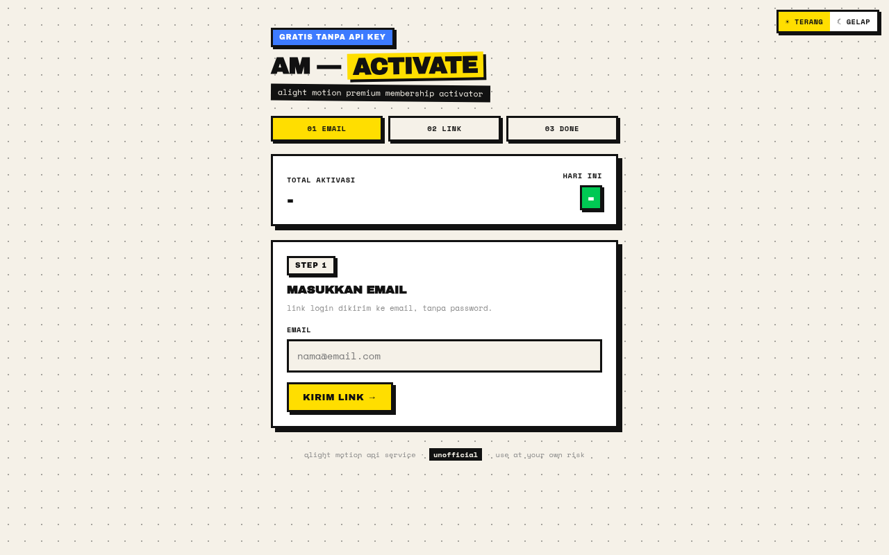
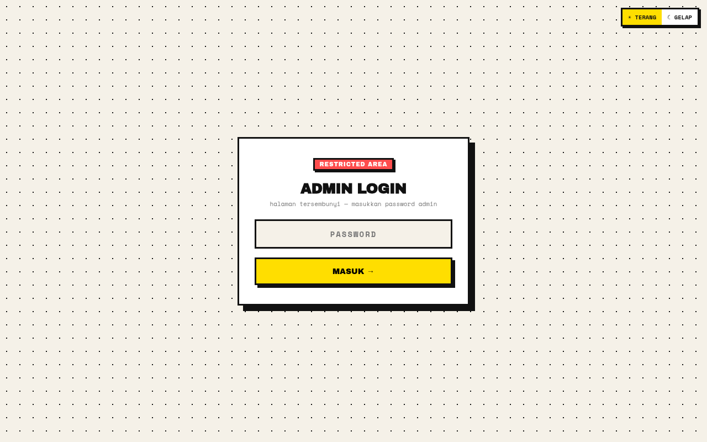

# AM-Reverse

[](https://nodejs.org)
[](https://vercel.com)
[](#arsitektur--flow)
[](LICENSE)

High-performance, zero-database reverse proxy, authentication relay, and session synchronization gateway for Alight Motion mobile clients. Designed to automate Firebase magic link authentication, secure token exchanges, and hybrid session token renewal via lightweight HTTP REST endpoints.

---

## 🌐 Web Preview

### 🖥️ Client Web Interface


### 🔐 Administrative Console


---

## 🎯 Untuk Apa Project Ini Berjalan?

Otomasi akun dan sinkronisasi sesi aplikasi mobile Alight Motion biasanya membutuhkan interaksi manual lewat deep link aplikasi Android/iOS, penanganan token Firebase Identity Platform, serta pertukaran `idToken` dan `refreshToken` yang rumit. 

Project **AM-Reverse** dibangun untuk:
1. **Mengeliminasi Kebutuhan Database Eksternal**: Berjalan sepenuhnya secara stateless atau menggunakan local file JSON (`data/`) tanpa ketergantungan PostgreSQL, MySQL, ataupun MongoDB.
2. **Menyederhanakan Otomasi Akun**: Mengubah alur multi-step autentikasi mobile (request email link &rarr; oobCode extraction &rarr; identity exchange &rarr; purchase verification) menjadi panggilan REST API sederhana yang bisa dipanggil oleh bot Telegram, terminal CLI, atau web UI.
3. **Mendukung Mode Autentikasi Hybrid**: Dapat berjalan dalam mode *Managed Key* (proteksi API Key `am-sk-...` untuk multi-tenant/client) maupun *Direct Token* (tanpa API key, langsung menggunakan raw token) secara fleksibel.
4. **Resiliensi Sesi Otomatis**: Menyediakan endpoint reaktivasi (`/api/reactivate`) untuk memperbarui sesi yang kadaluarsa menggunakan refresh token tanpa perlu login ulang dari awal.

---

## ⚖️ Kelebihan & Kekurangan

| Kategori | Kelebihan (Pros) | Kekurangan (Cons) |
|---|---|---|
| **Penyimpanan (Storage)** | **Zero External Database**: Siap jalan tanpa konfigurasi database server tambahan; mendukung file JSON lokal atau ephemeral `/tmp` di environment serverless. | **Multi-Instance Sync Terbatas**: Pada cluster serverless tanpa persistent volume (seperti Vercel free tier), penyimpanan sesi lokal akan di-reset saat instance di-recycle. |
| **Autentikasi** | **Hybrid Mode**: Mendukung autentikasi via query string (`?api_key=`), header `x-api-key`, header `Authorization: Bearer`, serta bypass mode untuk direct tokens. | **IP Rate Limit Upstream**: Terlalu banyak permintaan token dalam waktu singkat dari satu IP host bisa terkena rate limit dari upstream Firebase Auth. |
| **Performa & Ukuran** | **Ultra Lightweight**: Konsumsi RAM sangat rendah (<50MB) berbasis Express.js dan Node.js native crypto; latency minimal karena relay langsung ke upstream. | **Ketergantungan API Pihak Ketiga**: Sangat bergantung pada struktur payload dan stabilitas endpoint upstream Google Identity Toolkit & Cloud Functions. |
| **Integrasi Klien** | **Universal HTTP Method**: Semua endpoint utama mendukung metode `GET` dan `POST`, memudahkan integrasi ke script bot Telegram, cURL, maupun browser. | **Single-Point Maintenance**: Jika format verifikasi deep link atau User-Agent mobile berubah dari sisi upstream, relay proxy perlu diperbarui. |

---

## 🏗️ Arsitektur & Flow

```text
┌───────────────────────┐
│ Klien (Bot / Web / CLI)│
└───────────┬───────────┘
            │ 1. GET /api/send-link?email=...
            ▼
┌────────────────────────────────────────────────────────┐
│ AM-Reverse Gateway (:3000 / Edge)                      │
│ ├─ Middleware: Rate Limiter & Hybrid Auth Validator    │
│ ├─ In-Memory / Local Storage (/data atau /tmp)         │
│ └─ IP Header Spoofing & Mobile Dalvik Emulator         │
└───────────┬────────────────────────────────────────────┘
            │ 2. OOB Code Verification
            ▼
┌────────────────────────────────────────────────────────┐
│ Upstream Services                                      │
│ ├─ Google Identity Toolkit (Firebase Auth Exchange)    │
│ └─ Alight Creative Cloud Functions (Purchase Engine)   │
└────────────────────────────────────────────────────────┘
```

---

## 🚀 Panduan Deployment

### 1. Self-Hosted VPS (Node.js / Systemd)

```bash
# Clone repository
git clone https://github.com/rndsa/am-reverse.git
cd am-reverse

# Install dependencies
npm install --production

# Buat file konfigurasi environment
cp .env.example .env
nano .env

# Jalankan server
node server.js
```

Untuk menjalankan di background via **Systemd**:

```bash
# Salin unit file
sudo cp am-reverse.service /etc/systemd/system/
sudo systemctl daemon-reload
sudo systemctl enable --now am-reverse
```

### 2. Deploy ke Vercel (Serverless)

Project ini sudah dilengkapi konfigurasi `vercel.json` dan otomatis beralih ke mode ephemeral `/tmp` saat dijalankan di Vercel:

```bash
npm i -g vercel
vercel --prod
```

---

## 📡 API Reference Ringkas

Base URL: `http://localhost:3000` (atau domain produksi Anda)

| Endpoint | Method | Deskripsi | Parameter Utama |
|---|---|---|---|
| `/api/send-link` | `GET` / `POST` | Mengirimkan login link ke email target | `email`, `api_key` |
| `/api/verify-link`| `GET` / `POST` | Verifikasi magic link & provisioning | `email`, `magicLink`, `api_key` |
| `/api/reactivate` | `GET` / `POST` | Refresh sesi expired menggunakan refresh token | `refreshToken`, `api_key` |
| `/api/keys` | `GET` / `POST` | Manajemen API Key (Admin Only) | `x-admin-password` |

Dokumentasi lengkap dan contoh respons JSON tersedia di [API_DOCS.md](API_DOCS.md).

---

## 📄 Lisensi & Kontribusi

Dilisensikan di bawah [MIT License](LICENSE).
Dikembangkan oleh **ren** ([@rndsa](https://github.com/rndsa)) — Instagram: [@rskl411_](https://instagram.com/rskl411_).
